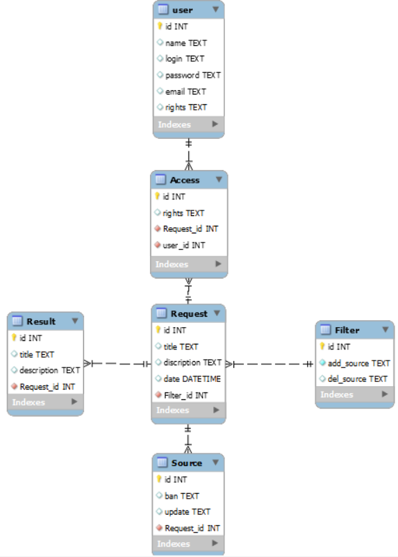

# **Модель бізнес-об'єктів**

@startuml

entity User 
entity User.name 
entity User.login 
entity User.password 
entity User.email 
entity User.rights

    User.name --* User 
    User.login --* User 
    User.password --* User 
    User.email --* User 
    User.rights --* User

entity Access 

entity Access.rights

    Access.rights -u-* Access

entity Request 
entity Request.id 
entity Request.title 
entity Request.description 
entity Request.date

    Request.id --* Request 
    Request.title --* Request 
    Request.description --* Request
    Request.date --* Request 

    Access "0," -u- "1,1" User 
    Access "0," -l- "1,1" Request 

entity Source 
entity Source.ban 
entity Source.updt

    Source.ban -u-* Source 
    Source.updt -u-* Source

entity Filter 
entity Filter.add_source 
entity Filter.del_source

    Filter.add_source -u-* Filter 
    Filter.del_source -u-* Filter

entity Result 
entity Result.id 
entity Result.title 
entity Result.description

    Result.id -u-* Result 
    Result.title -u-* Result 
    Result.description -d-* Result
    Request "0,1" -d- "1,1" Filter 
    Request "0," -d- "1," Source 
    Request "1,1" -d- "0,*" Result
@enduml

# **ER-модель**

@startuml

entity User { 
              name: TEXT 
              login: TEXT 
              password: TEXT 
              email: TEXT 
              rights: TEXT 
          }

entity Request { 
                id: INT 
                title: TEXT 
                description: TEXT 
                date: DATETIME 
            }

entity Source {
                ban: TEXT           
                updt: TEXT 
            }

entity Filter { 
                add_source: TEXT
                del_source: TEXT 
            }

entity Result { 
                id: INT 
                title: TEXT 
                description: TEXT 
            }

entity Access { 
                rights: TEXT 
}

User "1,1" -- "0," Access 
Access "0," -- "1,1" Request 
Request "0," -- "1," Source 
Request "1,1" -u- "0," Result 
Request "0,1" -r- "1,1" Filter

@enduml

# **Реляційна схема**

