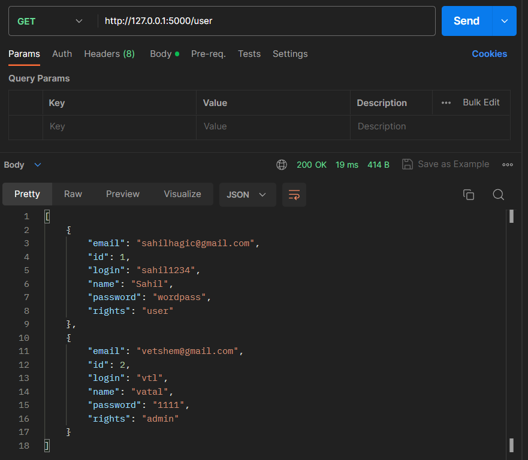
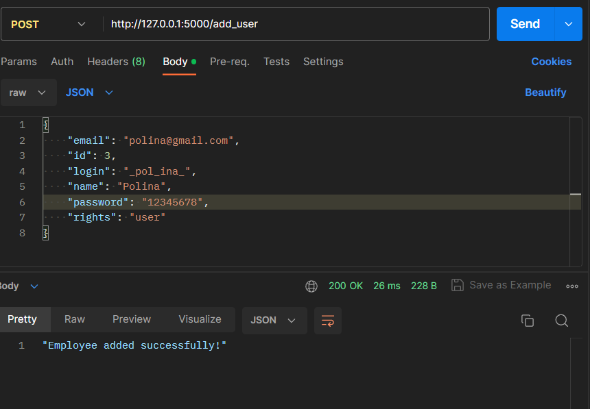
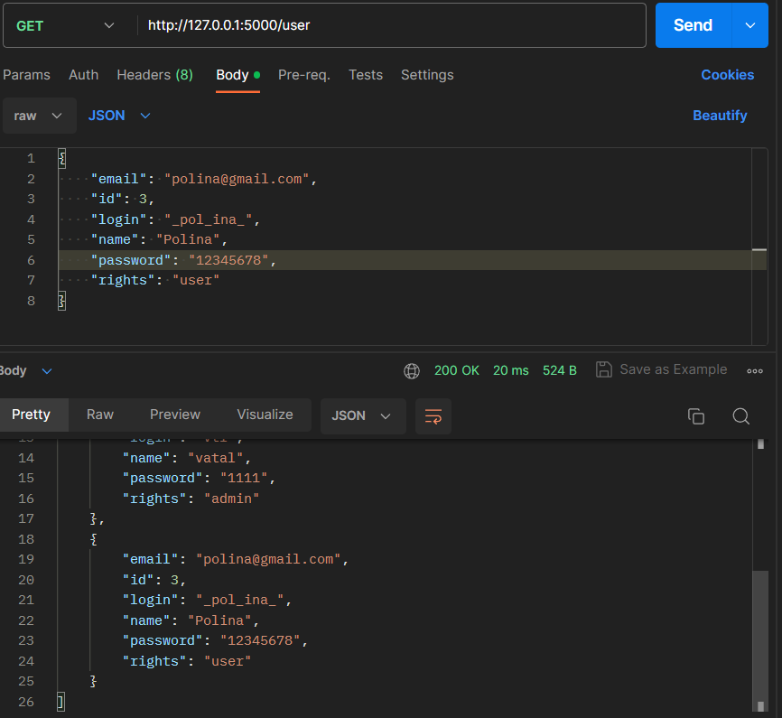
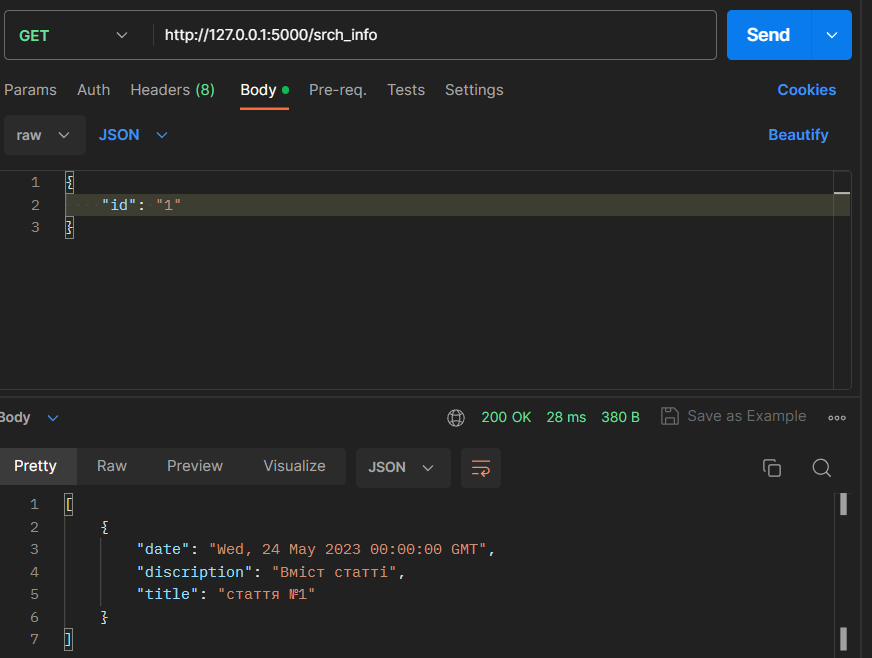
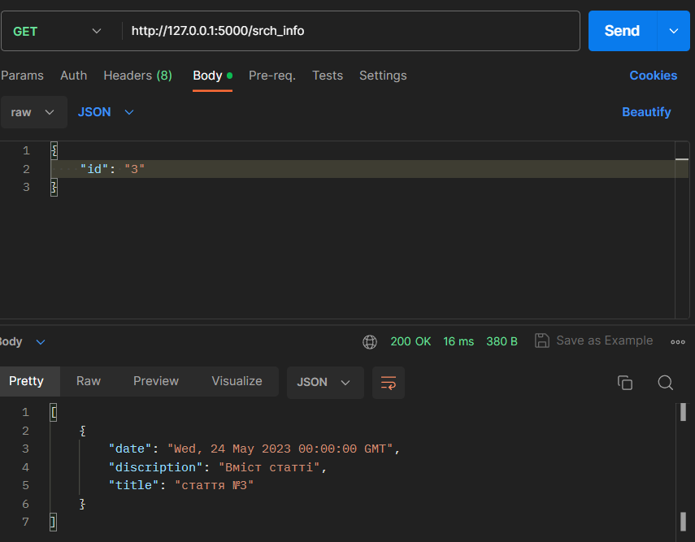
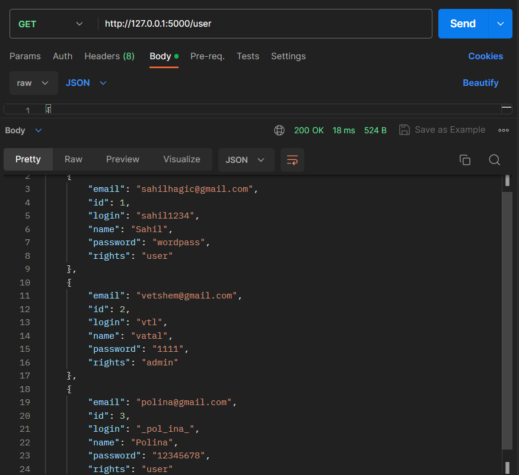
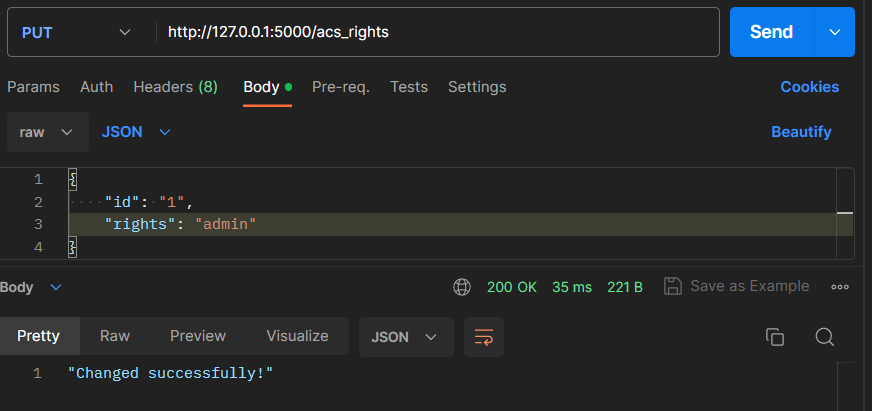
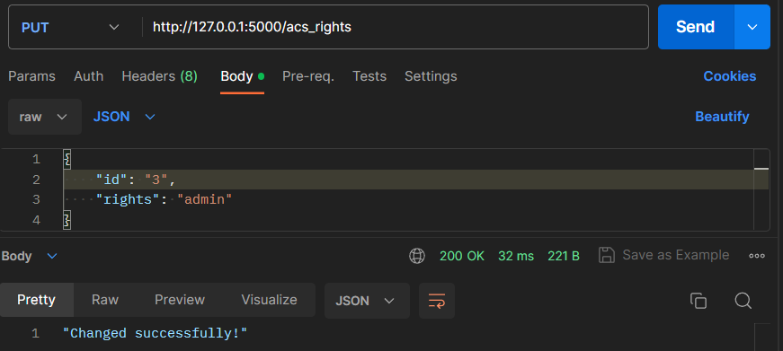
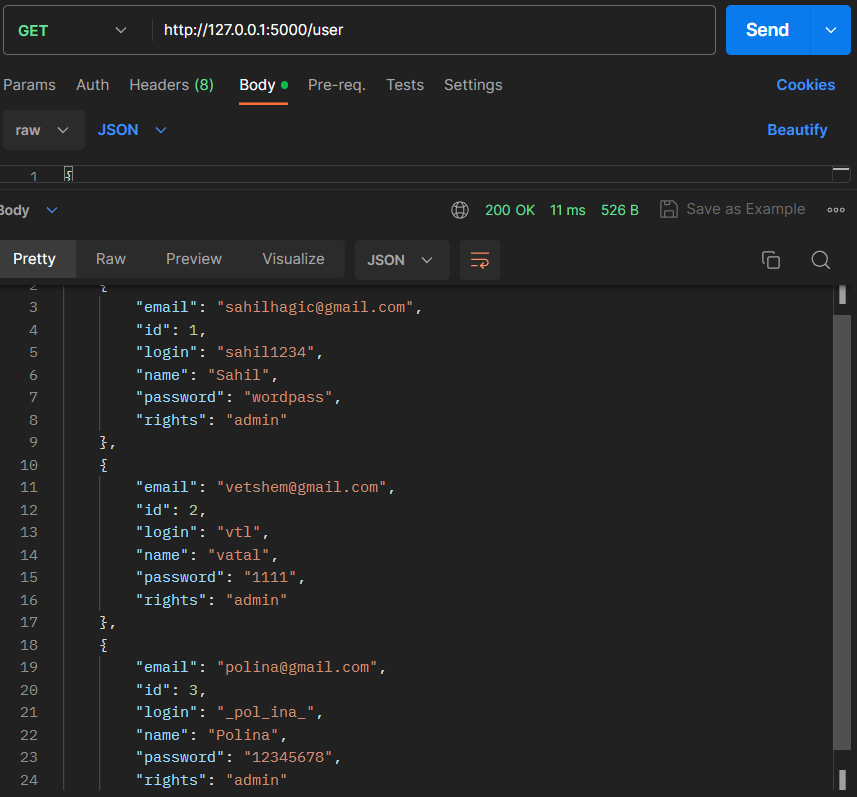

# Тестування працездатності системи

# GET user

**Перелік всіх користувачів** 

**Створення нового користувача**

*Таблиця після запиту*

# GET info

*Запит на отримання контенту*

# PUT rights

*Права користувачів*

*Зміна прав користувача адміністратором*

*Результат зміни прав*

